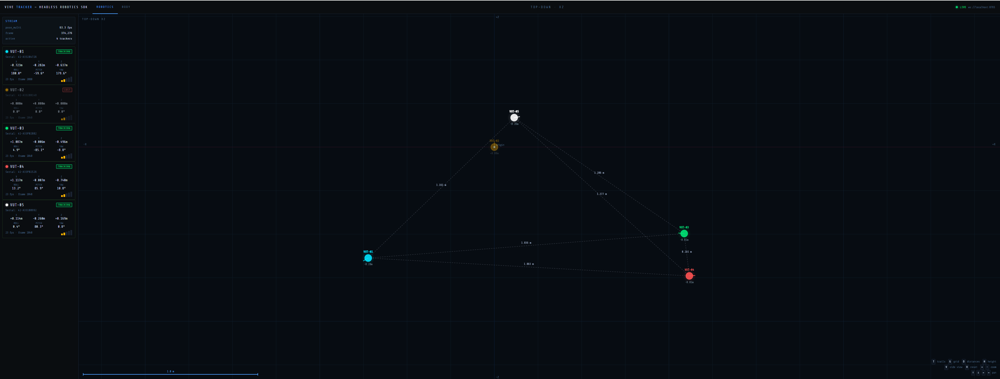
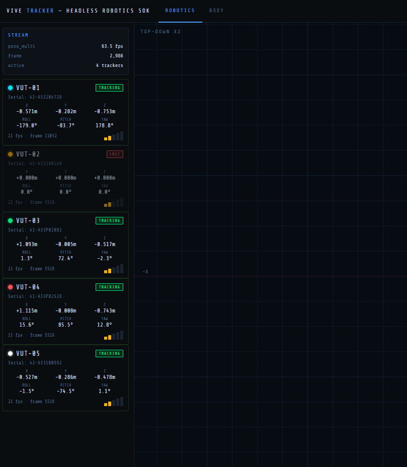
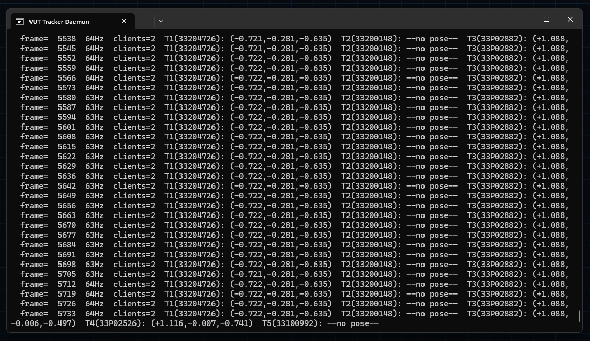
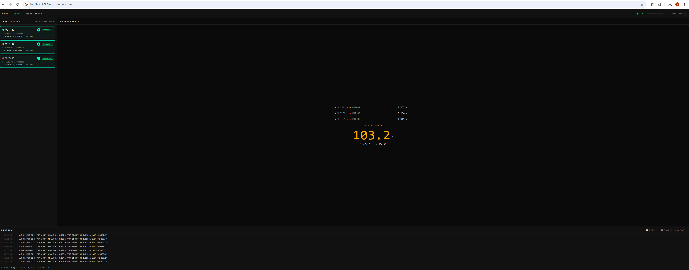
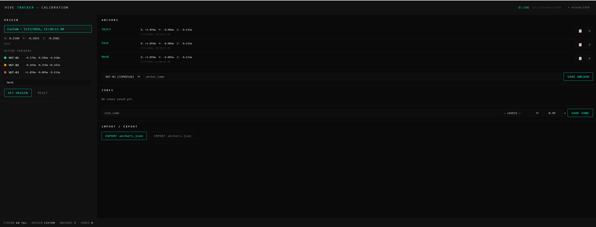

# VT Headless SDK

> ⚠️ **Alpha Release — v0.2.0-alpha**
> This SDK is in early development. APIs may change
> between releases. Not recommended for production use.
> Tested on 5x VIVE Ultimate Trackers (VUT) + 1 x Tracker dongle. 

> ⚠️ **Unofficial SDK — Community Project**
> UNOFFICIAL SDK.  This is an unofficial community alpha that uses publicly available runtime interfaces to read pose data from VIVE Ultimate Trackers in a headless SteamVR setup. It is not endorsed, supported, or maintained by HTC Corporation or Valve Corporation.

Headless 6DoF pose streaming for VIVE Ultimate Trackers.

No HMD. No VR headset. Tracker poses streamed directly
over WebSocket for robotics, motion capture, and body tracking.

---

## What this is

VT Headless SDK bridges SteamVR and Python, streaming live 6DoF poses
from VIVE Ultimate Trackers to any application via WebSocket.

- Real-time position + orientation per tracker
- Up to 5+ trackers simultaneously
- WebSocket API at `ws://localhost:8765`
- Includes robotics and body tracking visualisers
- Foundation for [vut-skeleton](placeholder) body tracking

---

## Prerequisites

### Hardware — choose one:

**Option A — VIVE Ultimate Tracker (VUT)**
- VIVE Ultimate Trackers (tested with 5x simultaneously)
- 1x Tracker Dongle (USB)
- VIVE Hub installed and trackers showing green

**Option B — Vive Tracker 3.0 + Base Stations**
- Vive Tracker 3.0 (tested with 3x simultaneously)
- 1x or 2x SteamVR Base Station 1.0 or 2.0
- No VIVE Hub required
- Works in any lighting including darkness
- Ensure base stations are active and trackers
  show solid green in SteamVR before starting SDK
- For setup: refer to HTC and Valve documentation

### Software (both options)
- Windows 11
- SteamVR installed and running
- Python 3.10+

---

## Installation

Clone and install from source:

```bash
git clone https://github.com/nandunabey/VT-Headless-SDK.git
cd VT-Headless-SDK
pip install -e vut-sdk/
```

---

## Quick start

**Step 1 — Start the SDK stack:**
```
START_VUT_ROBOTICS_SDK.bat
```

**Step 2 — Check tracker status:**
```bash
python -m vut_sdk.tools.vut_status
```

**Step 3 — Connect your app:**
```python
import asyncio
import websockets
import json

async def receive_poses():
    async with websockets.connect("ws://localhost:8765") as ws:
        async for message in ws:
            poses = json.loads(message)
            for tracker_id, pose in poses.items():
                print(tracker_id, pose["position"], pose["rotation"])

asyncio.run(receive_poses())
```

### Using the Python SDK directly
```python
from vut_sdk.tracker import VUTTracker

tracker = VUTTracker("41-A33204726")  # serial number
tracker.connect()

# Single pose read
pose = tracker.get_pose()
print(pose.position, pose.rotation)

# Streaming
def on_pose(pose):
    print(f"{pose.tracker_id}: {pose.position}")

tracker.on_pose(on_pose)
tracker.stream()  # blocks, calls on_pose at --fps rate
```

### Multiple trackers simultaneously
```python
from vut_sdk.fleet import VUTTrackerFleet

fleet = VUTTrackerFleet()
fleet.connect_all()

for serial, pose in fleet.get_poses().items():
    print(f"{serial}: {pose.position}")
```

---

## Screenshots

### Robotics visualiser — 5-tracker top-down view

*5-tracker top-down view with distance lines, 63fps*

### Tracker dashboard — live telemetry

*Live tracker dashboard — serial, pose, battery, tracking status*

### Tracker daemon — WebSocket stream

*VUT Tracker Daemon — serial-keyed pose stream at 64Hz*

### Toolkit tools

*Tracker role assignment — one-time setup*

*Session recorder — record, playback, export CSV*

*Live spatial measurement — distance and angle*

*Calibration — named spatial anchors*

---

## Demo

### Robotics visualiser — live 5-tracker tracking
[](https://www.youtube.com/watch?v=VURLUIOaj9Y)
*Unofficial VT Headless SDK — Robotics view*

### Body tracking visualiser
[](https://www.youtube.com/watch?v=1m04uqlcWGM)
*Unofficial VT Headless SDK — Body tracking*

---

## Architecture

```
5x VIVE Ultimate Trackers
1x Tracker dongle
  → SteamVR
  → vtrackerd_openvr.py
  → WebSocket ws://localhost:8765
  → Your application
```

---

## Toolkit

Browser-based tools served at `http://localhost:8080`
after running `START_VUT_ROBOTICS_SDK.bat`:

| Tool | URL | Description |
|------|-----|-------------|
| Visualiser | /visualiser.html | Live robotics dashboard |
| Setup | /setup.html | Tracker role assignment |
| Recorder | /recorder.html | Record, playback, export CSV |
| Measurement | /measurement.html | Live distance + angle |
| Calibration | /calibration.html | Origin + named anchors |

Download the installer:
[VT-Headless-SDK-Setup-v0.2.0-alpha.exe](installer/)
Includes Python prerequisites check and auto-setup.

---

## WebSocket API

Broadcast rate is set with `--fps` (default 30, start script uses 60):

| `--fps` | Interval | Latency estimate | Use case |
|---------|----------|-----------------|----------|
| 30      | ~33 ms   | ~33 ms          | Body tracking, low CPU |
| 60      | ~17 ms   | ~17 ms          | Robotics (recommended) |
| 100     | ~10 ms   | ~10 ms          | Minimum latency, higher CPU |

Each broadcast is a flat JSON dict keyed by hardware serial number
(stable across SteamVR restarts), plus a `meta` block:

```json
{
  "41-A33204726": {
    "position":      {"x": 0.12,  "y": 0.95,  "z": -0.34},
    "rotation":      {"w": 0.99,  "x": 0.01,  "y": 0.05,  "z": 0.02},
    "timestamp":     1715000000.123,
    "battery_pct":   46,
    "session_index": 1,
    "model":         "VIVE Ultimate Tracker 1"
  },
  "41-A33200148": {
    "position":      {"x": -0.05, "y": 0.10,  "z": 0.15},
    "rotation":      {"w": 1.0,   "x": 0.0,   "y": 0.0,   "z": 0.0},
    "timestamp":     1715000000.123,
    "battery_pct":   null,
    "session_index": 2,
    "model":         "VIVE Ultimate Tracker 3"
  },
  "meta": {
    "fps":           60,
    "latency_ms":    17,
    "tracker_count": 2
  }
}
```

`battery_pct`: integer 0–100, or `null` if the property read failed.
`session_index` and `model` are informational — never use them as stable
identifiers. Always key on the serial number (top-level dict key).
`meta` is not a tracker entry — skip it when iterating poses.

---

## Tested on

- Windows 11 ✓
- Python 3.14 ✓
- 5x VIVE Ultimate Trackers confirmed simultaneously
- Firmware: 1.0.999.178
- Standard tracking mode confirmed (no licence required)
- VO mode confirmed with Business+ licence
- vut-skeleton body tracking: 5 trackers → 17 joints
- Vive Tracker 3.0 + Base Station 1.0 ✓
- Vive Tracker 3.0 + Base Station 2.0 ✓

---

## Limitations

- Unofficial: not affiliated with or supported by HTC VIVE or Valve
- Standard mode requires room scan each session
- Windows only (SteamVR dependency)
- Tracker IDs may reorder on reconnect — use serial numbers for
  consistent assignment
- SteamVR must be running before starting the SDK stack
- Mixed mode (VUT + Lighthouse simultaneously) not yet validated

Position noise floor: 0.30mm 3D RMS (stationary, 64Hz)
See [docs/ACCURACY.md](docs/ACCURACY.md) for full characterisation.

---

## Related projects

### vut-skeleton
17-joint body tracking skeleton solver built on vut-sdk.
5 VIVE Ultimate Trackers → full body pose with inferred joints.
https://github.com/nandunabey/vut-skeleton

---

## AI Agent Integration (MCP)

VT Headless SDK includes a Model Context Protocol (MCP)
server — connect Claude Code or any MCP-compatible AI
agent to your trackers in minutes.

Requires: [vut-toolkit](https://github.com/nandunabey/vut-toolkit-unofficial)

```bash
cd vut-toolkit/mcp/vut-mcp
npm install
claude mcp add vut-mcp node "C:/path/to/vut-toolkit/mcp/vut-mcp/index.js"
```

### Available MCP tools
| Tool | Description |
|------|-------------|
| get_all_poses | All active tracker positions |
| get_tracker_pose | Single tracker by serial |
| get_distance | Distance between two trackers |
| get_angle | Angle at middle tracker (3 points) |
| get_spatial_summary | Natural language scene description |
| watch_tracker | Block until tracker moves threshold |
| get_anchors | Named spatial anchors |
| distance_to_anchor | Tracker distance to named point |
| anchor_to_anchor_distance | Distance between two anchors |

### Example Claude Code session

```
"What trackers are active right now?"
"How far apart are VUT-01 and VUT-03?"
"Watch VUT-02 and tell me when it moves 50mm"
"How far is VUT-01 from the desk anchor?"
"Delete the test anchor"
```

Believed to be the first MCP server providing real-time
physical spatial perception via consumer hardware. May 2026.

---

## Author

Nandun Abeynayake
github.com/nandunabey

---

## Licence

MIT
